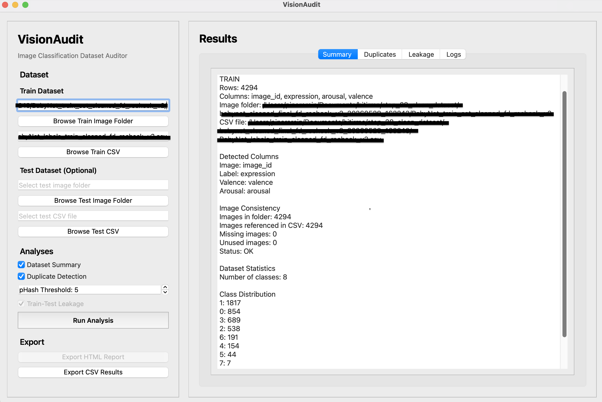
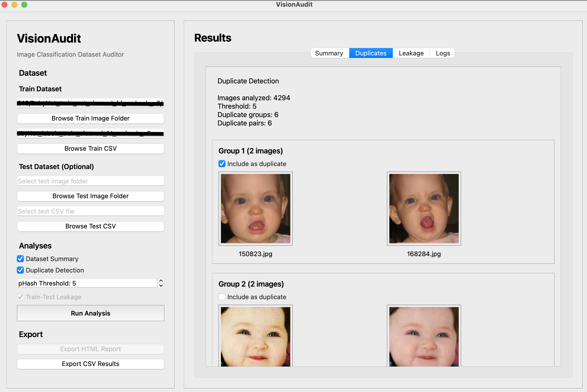

# VisionAudit

VisionAudit is a cross-platform desktop application for auditing image classification datasets before model training.

It helps identify common dataset quality issues such as missing images, unused files, class imbalance, and duplicate images through a simple graphical interface — without modifying the original dataset.

## Features

### Dataset Validation
- Load train image folders and CSV annotation files
- Optionally load a test dataset
- Automatically detect common image and label columns
- Compare CSV image references with files in the image directory
- Detect missing and unused images

### Dataset Statistics
- Number of samples
- Number of classes
- Class distribution
- Automatic use of label names provided by the dataset

### Duplicate Detection
- Perceptual hash (pHash) based duplicate detection
- Adjustable Hamming distance threshold
- Duplicate grouping
- Visual thumbnail comparison
- Manual review of detected duplicate groups
- False-positive groups can be excluded before export

### CSV Export
- Export reviewed duplicate groups to CSV
- Preserve the original dataset metadata columns
- Original dataset files are never modified

## Screenshots

### Dataset Summary



### Duplicate Detection and Review



## Installation

Clone the repository:

```bash
git clone https://github.com/pinarercin/VisionAudit.git
cd VisionAudit
```

Create and activate a virtual environment:

```bash
python -m venv venv
source venv/bin/activate
```

On Windows:

```bash
venv\Scripts\activate
```

Install dependencies:

```bash
pip install -r requirements.txt
```

Run VisionAudit:

```bash
python main.py
```

## Project Structure

```text
VisionAudit/
├── analysis/
├── assets/
├── parsers/
│   └── dataset_parser.py
├── reports/
├── ui/
│   └── main_window.py
├── utils/
├── main.py
├── requirements.txt
└── README.md
```

## Dataset Requirements

VisionAudit expects:

- An image directory
- A CSV annotation file containing an image identifier or filename column
- A label column for dataset statistics

Common column names such as `image_id`, `image`, `filename`, `label`, `class`, `category`, and `expression` are automatically detected.

Additional metadata columns are preserved when duplicate results are exported.

## Duplicate Detection

VisionAudit currently uses perceptual hashing (pHash) to identify visually similar images.

The pHash threshold controls how similar two images must be to be considered potential duplicates:

- Lower threshold → stricter matching
- Higher threshold → more permissive matching

Detected images are grouped and displayed as thumbnails for manual review before export.

## Read-Only Dataset Policy

VisionAudit never deletes, renames, moves, or modifies original images or annotation files.

All analysis is read-only. Exported results are written to separate files.

## Roadmap

- Train-test leakage detection
- Optional face-descriptor analysis for face datasets
- HTML reports
- Improved duplicate review workflow
- Performance improvements for large datasets

## Status

VisionAudit is currently in early development.

**Current release: v0.1.0**

The first release focuses on dataset validation, dataset statistics, pHash duplicate detection, manual duplicate review, and CSV export.

## Author

**Pınar Erçin**  
AI & Data Engineer
GitHub: [@pinarercin](https://github.com/pinarercin)